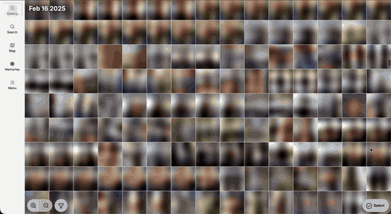
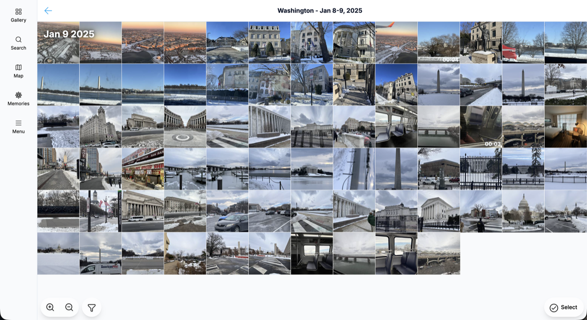
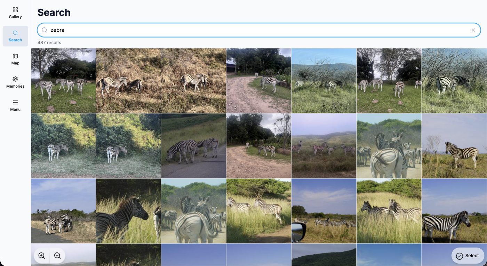
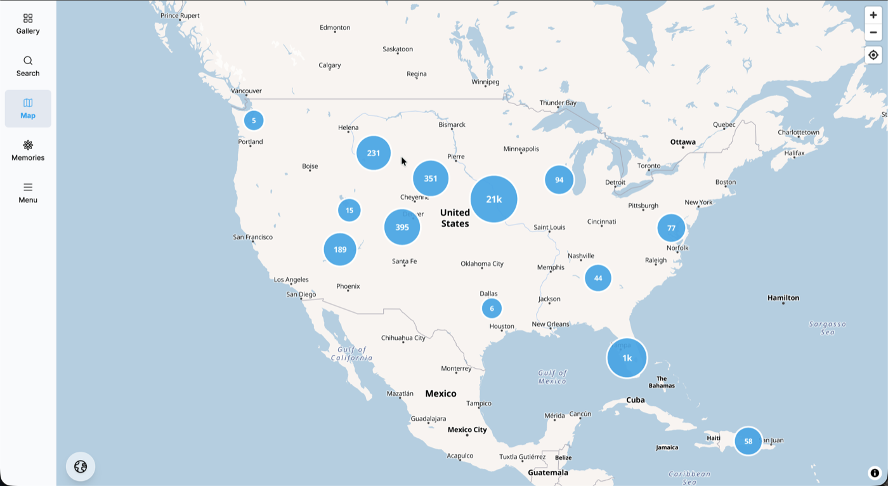
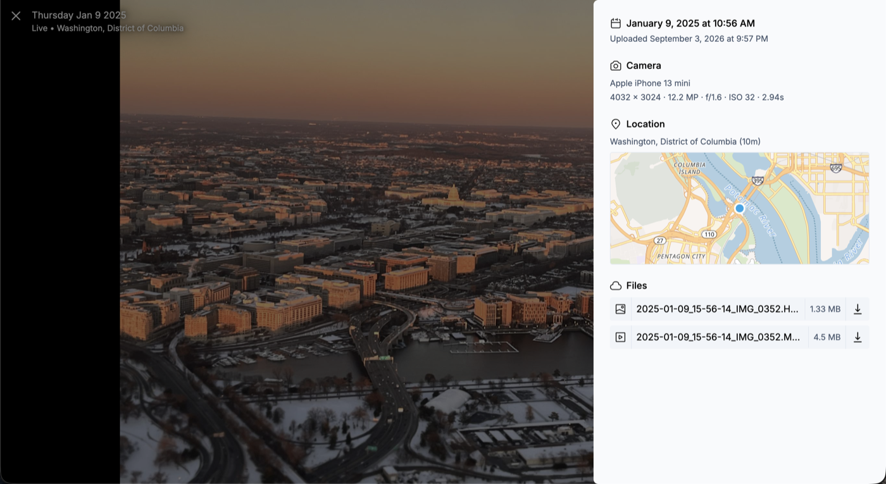

<p align="center">
  
</p>

# PhotoFlow

A photo library with **no server and no API**. An alternative to iCloud Photos and
Google Photos for people who want their photos kept as ordinary files in a bucket
they control.

Your photos live in your own [Backblaze B2](https://www.backblaze.com/cloud-storage)
bucket. A small program on your Mac runs once a day and turns new uploads into a
static catalog, and the app at [photoflow.outin.space](https://photoflow.outin.space)
reads that catalog straight out of the bucket. There is nothing in between, so the
bill is your storage and nothing else.

- **Mobile first**, and a full desktop app too.
- **Works offline.** It is a PWA, so the gallery keeps working with no connection.
- **Fast.** Thumbnails and placeholders are precomputed, and the catalog is cached
  a month at a time rather than fetched per photo.
- **In-browser AI search.** Search phrases like "red bicycle in the snow"; no
  query ever leaves the device.
- **A map** of everywhere you have taken a photo.
- **Automatic trip detection**, plus year and "one year ago" views.
- **Albums**, and **temporary share links**.
- **Apple Live Photos.** Both halves stay together as one photo.
- **You own the storage.** It is your bucket, your keys, and ordinary files in it.
  Originals are never modified or deleted by anything in this repo.

<p align="center">
  <br>
  <em>Scrolling a year of photos. Placeholders draw instantly and the thumbnails
  catch up, so the gallery never blocks on the network.</em>
</p>

|  |  |
| --- | --- |
| <br>A trip, detected automatically from the dates and places of the photos in it. | <br>Searching for "zebra". The phrase is encoded in the browser; no query leaves the device. |
| <br>Everywhere you have taken a photo, clustered by place. | <br>A Live Photo with its camera, capture time and location, and both files to download. |

## Status

PhotoFlow is young. I (Nick) use it every day, but expect rough edges. Open an
issue when something breaks.

## Setup

You need a Backblaze account and a Mac that is usually switched on.

### 1. Create a bucket and a key

In Backblaze, create a bucket. Make it **private**. Don't enable object-versioning as it will inflate your storage costs.

Then create one application key with **read and write** access, restricted to that
bucket. The worker, the app and your phone all use it. Deleting it
is the emergency lever: it ends access to every URL ever signed with it, share links
included.

### 2. Install the worker on your Mac

```bash
brew install uv ffmpeg exiftool
git clone https://github.com/outinspace/photoflow
cd photoflow/worker
cp .env.example .env
```

Open `.env` and fill in your bucket's endpoint and name, the region from the
endpoint, and the key. Then run it once by hand:

```bash
uv run worker
```

The first run checks that the bucket is private and offers to set the access rule
the app needs. When both are already right it says nothing. Now schedule it to run daily on your machine:

```bash
uv run worker install
```

A run missed while the Mac was asleep happens when it wakes. A Mac that is switched
off skips that day; your photos are still safe in the bucket and get catalogued next
time. If a run fails, a note saying why opens in TextEdit, and the app shows a banner
once no run has been recorded for three days.

To update, `git pull` in the checkout; the next run uses the new code. To stop,
`uv run worker uninstall`. Run exactly one worker per bucket.

### 3. Open the app

Go to [photoflow.outin.space](https://photoflow.outin.space) and enter your endpoint,
bucket and key. They are stored in that browser and sent nowhere else. A second
device is connected by scanning a QR code from Menu > Link Device > Show QR Code.

On a phone, install it to the home screen after connecting, so it opens full screen
and keeps working offline. Open [photoflow.outin.space](https://photoflow.outin.space)
in Safari on iOS and tap Share > Add to Home Screen, or in Chrome on Android and tap
menu > Add to Home screen. The settings live in the browser profile, so scan the QR
code in the installed app if the home screen copy opens to the setup form.

### 4. Back up your phone

Photos are picked up from the `incoming/` folder of the bucket, so any app that can
upload to S3 works. [PhotoSync](https://www.photosync-app.com/) is the usual choice
on iOS and Android: create an S3 destination, point it at your bucket with the same
key, set the directory to `incoming`, and turn on autotransfer while charging.

## Advanced

### Hosting the app yourself

The app is a static site. Nothing in the build names a bucket, so one deployment
serves any number of people.

```bash
npm install
npm run build
```

Deploy `src/dist/` to any static host (Cloudflare Pages, Netlify and GitHub Pages are
all free at this scale). **It must be served over HTTPS**, or over plain `http` on
`localhost` exactly; the app signs its requests with WebCrypto, which browsers only
expose in a secure context. Set `PHOTOFLOW_APP_ORIGIN` in the worker's `.env` to your
address so the access rule it writes names it.

### The bucket's CORS rule

The browser talks to the bucket directly, so the bucket has to allow it. The worker
writes this rule on its first interactive run. Setting it by hand works too. Reads
carry their signature in the query string and are not preflighted; writes carry it
in headers and are, which is why `PUT` and the signing headers have to be allowed:

```json
[{
  "AllowedOrigins": ["https://photoflow.outin.space"],
  "AllowedMethods": ["GET", "HEAD", "PUT"],
  "AllowedHeaders": ["*"],
  "ExposeHeaders": ["ETag"],
  "MaxAgeSeconds": 3600
}]
```

On Backblaze B2 this means a custom rule; the built-in "share everything" preset is
read-only. B2's S3 endpoint has no CORS calls, so the worker uses B2's own API,
which needs a key with `writeBuckets`. It prints the rule to paste when the key it
has cannot do it.

### Separate keys

One key is the easy setup, not the only one. Each part needs less than the whole:
the worker needs read and write, the app needs read, write and list, and the phone
only needs to write under `incoming/`. A write-only key restricted to that prefix is
worth making for the phone, since a leaked one can add junk but cannot read or
destroy anything.

### A second bucket on the same Mac

Each bucket gets its own agent and log, so install once per bucket. Keep a settings
file per bucket and name it when installing:

```bash
uv run worker --env ~/family.env install
uv run worker --env ~/family.env uninstall
```

### Other S3 providers

Anything S3-compatible with CORS support works. The worker's `.env` takes the
endpoint and region; the connect screen refuses a public bucket by writing a
one-byte object and checking it cannot be read back unsigned.

### Every setting

[`worker/.env.example`](worker/.env.example) lists every setting with what it does.
A run works through everything waiting in batches, publishing after each, so an
interrupted run loses at most one batch; `uv run worker --workers 8` gets through a
large first import quickly.

## How it works

```
  phone / browser  ──upload──▶  bucket: incoming/
                                     │
                          daily worker (worker/)
                                     │
                                     ▼
                    bucket: original/  tile-image/  preview/
                            catalog/   meta/
                                     │
                                     ▼
                            the app, in the browser
```

- **The catalog is static JSON**, one shard per upload month, so a month stops
  changing once it is over and browsers cache it indefinitely.
- **Favourites, albums and deletions are written by browsers**, each device to its
  own log file, and merged by the worker. One writer per file means no conflicts
  and no locking.
- **Search embeddings are precomputed** by the worker, about 516 bytes a photo. The
  browser downloads them once and encodes only your search phrase locally.
- **Originals are never modified or deleted** by anything in this repo.
- **Every video gets a transcoded preview**, including one already in a codec the
  browser plays: what a camera writes is laid out for a file rather than for a
  network, and starting playback promptly is what the preview is for.

The pipeline is nine steps run in order, listed in
[`worker/photoflow/pipeline.py`](worker/photoflow/pipeline.py).

## Development

```
src/      the app: React, TanStack Router and Query, Tailwind, Vite
worker/   the daily worker: Python, run with uv
dev/      a local S3 server and a seed script, for working without a real bucket
```

Both test suites need no credentials and touch no network:

```bash
npm test                                          # front end
cd worker && uv run --extra dev python -m pytest  # worker
```

To exercise the whole thing against a local S3 server with generated photos:

```bash
docker compose -f dev/docker-compose.yml up -d
uv run --project worker --with pillow python dev/seed.py
npm start
```

That creates a private bucket and fills `incoming/` with sample photos and clips,
then prints the worker command to run and what to connect the app to. Reset with
`docker compose -f dev/docker-compose.yml down -v`.

## License and name

The code is licensed under the
[GNU Affero General Public License, version 3](LICENSE). You may run it, change it,
and share it, and if you offer a modified version as a service you must publish your
changes under the same terms.

The name **PhotoFlow** and its icon are not covered by that licence. A fork is
welcome, and should call itself something else so that people know whose software
they are running and where to report a problem.

Pull requests are welcome. The first one needs a line agreeing to the short
[Contributor License Agreement](CLA.md). It lets the project change licence later
without tracking down every past contributor, and takes nothing away from you.
